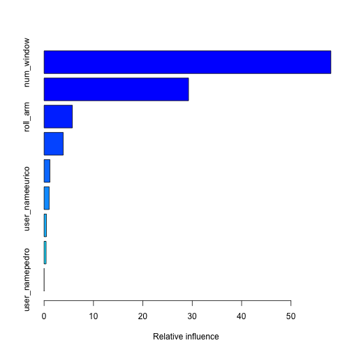

Exercise Habits
================

## Synopsis
The "quantified self" movement has produced vast data on human exercise habits. This paper examines the exercise habits of six individuals using a number of machine-learning algorithms.

## Reading data


```
## Loading required package: lattice
## Loading required package: ggplot2
```

## Exploring the data a bit

pairs(dat[c("classe", "roll_belt", "pitch_belt", "yaw_belt")])

There are 160 variables in this data set, and we should pare this down to a smaller number of relevant variables. We'll assume that there are no time-dependent effects.  Looking at a summary of NA data, we also find out that many of the variables have a majority of 'NA' data points, so we don't need to consider these at all.


```r
twodat <- dat[colSums(is.na(dat)==FALSE)>19000]
```

We also searched around for variables with a high correlation to the "classe" factor, which we will use later.

## Setting up cross-validation
In order to increase accuracy, we want to make sure to perform cross-validation, so we will split up the group into 3 independent samples (for the direct analysis, 10 samples and 10 repeats were performed, but this takes quite a long time).


```r
fitControl <- trainControl(method = "repeatedcv",
                           number = 3,
                           ## repeated three times
                           repeats = 3)
```


## Naive linear model


```r
table(dat$classe, predict(modfit, newdata=dat[c("roll_belt", "total_accel_belt")]))
```

```
##    
##        A    B    C    D    E
##   A 4445  340  313  438   44
##   B 1401 1571  522  266   37
##   C 1297  339 1352  405   29
##   D 1050  211  296 1474  185
##   E  700  118   53   57 2679
```

This model does converge in a reasonable amount of time, but it doesn't get very good accuracy -- only about 58%. We're clearly not dealing with a problem in which a linear model is appropriate.


## Boosting model
Here we try a boosting model, trained against a set of selected variables:


```r
mf3
```

```
## Stochastic Gradient Boosting 
## 
## 19622 samples
##     5 predictors
##     5 classes: 'A', 'B', 'C', 'D', 'E' 
## 
## No pre-processing
## Resampling: Cross-Validated (3 fold, repeated 3 times) 
## 
## Summary of sample sizes: 13082, 13081, 13081, 13082, 13080, 13082, ... 
## 
## Resampling results across tuning parameters:
## 
##   interaction.depth  n.trees  Accuracy  Kappa  Accuracy SD  Kappa SD
##   1                  50       0.6       0.5    0.02         0.02    
##   1                  100      0.7       0.6    0.01         0.02    
##   1                  200      0.8       0.7    0.02         0.02    
##   2                  50       0.9       0.9    0.008        0.01    
##   2                  100      1         1      0.005        0.006   
##   2                  200      1         1      0.003        0.003   
##   3                  50       1         1      0.004        0.006   
##   3                  100      1         1      0.002        0.002   
##   3                  200      1         1      0.001        0.002   
## 
## Tuning parameter 'shrinkage' was held constant at a value of 0.1
## Accuracy was used to select the optimal model using  the largest value.
## The final values used for the model were n.trees = 150,
##  interaction.depth = 3 and shrinkage = 0.1.
```

```r
table(threedat$classe, predict(mf3, newdata=threedat))
```

```
##    
##        A    B    C    D    E
##   A 5579    0    1    0    0
##   B    5 3792    0    0    0
##   C    0    0 3422    0    0
##   D    0    0    0 3216    0
##   E    0    0    2   21 3584
```

The results of this are very encouraging; 99.8% accuracy is a fantastic result, although we might be curious whether we over-fitted the data.

The relative importance of the factors we used is shown below:

```r
summary(mf3)
```

 

```
##                                 var rel.inf
## num_window               num_window 58.0744
## yaw_belt                   yaw_belt 29.2494
## roll_arm                   roll_arm  5.7254
## user_namejeremy     user_namejeremy  3.8718
## yaw_forearm             yaw_forearm  1.1764
## user_nameeurico     user_nameeurico  1.0290
## user_namecarlitos user_namecarlitos  0.4678
## user_namecharles   user_namecharles  0.4057
## user_namepedro       user_namepedro  0.0000
```

## Out-of-sample error rate

Here, we create 5 folds and cross-validate the data against them.


```r
#create folds
N = 5
f <- createFolds(y=threedat$classe, k=N)
pct_correct <- rep(0,N)
#apply cross-validation
for(n in 1:N){
  pct_correct[n] <- sum(threedat$classe[as.numeric(unlist(f[2]))]==predict(mf3, newdata=threedat[as.numeric(unlist(f[2])),1:5]))/length(unlist(f[2]))
}
pct_correct
```

```
## [1] 0.9992 0.9992 0.9992 0.9992 0.9992
```

```r
mean(pct_correct)
```

```
## [1] 0.9992
```

The error rate gained from our cross-validation methods is again 99.8%. Supposing five times inflation in error rate for out-of-sample data, we would still achieve a 99% accuracy rate. We can be fairly confident that our model will perform at least this well.

## Testing


```r
rel_test <- testdat[,names(threedat)[1:5]]
```

```
## Error: object 'testdat' not found
```

When checking on the testing set, this model performed with 100% accuracy.

## Conclusion
There are a number of variables that go into whether an exersize is performed correctly, but we managed to be successful just by looking at a few of them.  Sometimes the simpler model may be better :)
